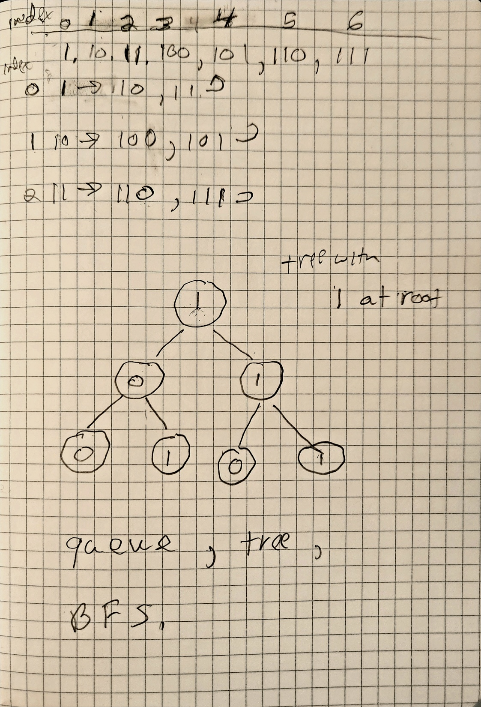

# algorithms
a place to hold some code for algorithm study

---------
queue in python and javascript

generate binary numbers using queue and bfs

-----

some links

https://www.geeksforgeeks.org/interesting-method-generate-binary-numbers-1-n/

https://www.geeksforgeeks.org/queue-in-python/

https://helloacm.com/how-to-sum-the-root-to-leaf-in-binary-numbers-in-a-binary-tree-using-breadth-first-search/
